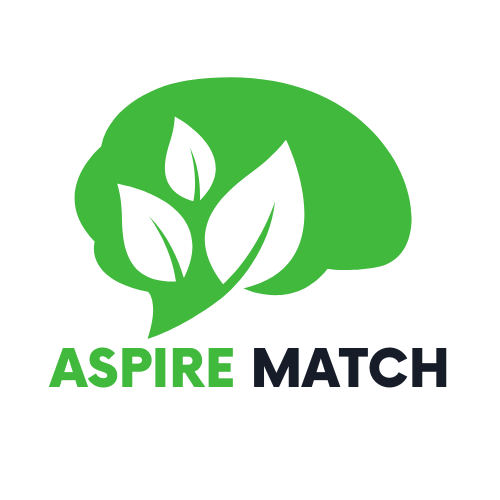

# AspireMatch



[AspireMatch](https://agent.ai/profile/dozf61ogwr83iefi) is the backend service for an agent on [Agent.ai](https://agent.ai/) that matches organizations with grants from [Grants.gov](https://grants.gov/) based on their websites or textual descriptions.

## Overview

AspireMatch leverages [AWS Lambda](https://aws.amazon.com/lambda/) and [API Gateway](https://aws.amazon.com/api-gateway/) to process and analyze grant data from Grants.gov. The service uses a Lambda function to download, extract, and parse XML data from grants.gov, and then stores the relevant information in an S3 bucket. The agent on Agent.ai can then use this data to recommend grants to organizations based on their mission, goals, and activities.

## Features

- **Grant Data Extraction**: Downloads and extracts grant data from grants.gov.
- **XML Parsing**: Parses XML data to identify relevant grants.
- **S3 Storage**: Stores parsed grant data in an [S3 bucket](https://aws.amazon.com/s3/).
- **API Gateway Integration**: Provides an API endpoint for the Agent.ai agent to query grant data.
- **Grant Recommendations**: Matches organizations with suitable grants based on their website or textual descriptions.

## Architecture

1. **AWS Lambda**: The core processing logic is implemented in a Lambda function.
2. **AWS S3**: Stores the extracted and parsed grant data.
3. **AWS API Gateway**: Provides a RESTful API endpoint for querying grant data.
4. **Agent.ai**: Uses the API to recommend grants to organizations.

## Setup

1. **Clone the Repository**:
    ```bash
    git clone https://github.com/kevinl95/AspireMatch.git
    cd AspireMatch
    ```

2. **Deploy the CloudFormation Stack**:
    - Ensure you have the AWS CLI installed and configured.
    - Deploy the [CloudFormation](https://aws.amazon.com/cloudformation/) stack to set up the necessary AWS resources.
    ```bash
    aws cloudformation deploy --template-file cloudformation.yml --stack-name AspireMatchStack --capabilities CAPABILITY_NAMED_IAM
    ```

## Usage

1. **API Endpoint**:
    - The API endpoint provided by API Gateway can be used to query grant data.
    - You will get your own endpoint URL after deploying the CloudFormation stack.
    - Example request:
    ```bash
    curl -X GET https://your-api-id.execute-api.your-region.amazonaws.com/prod/grants
    ```

2. **Agent.ai Integration**:
    - The agent on Agent.ai uses the API to recommend grants to organizations based on their website or textual descriptions.

## Contributing

1. Fork the repository.
2. Create a new branch (`git checkout -b feature-branch`).
3. Make your changes.
4. Commit your changes (`git commit -am 'Add new feature'`).
5. Push to the branch (`git push origin feature-branch`).
6. Create a new Pull Request.

## License

This project is licensed under the MIT License - see the LICENSE file for details.